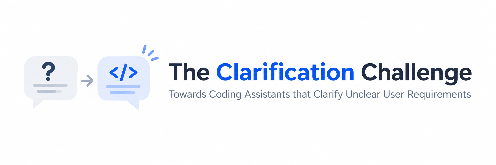

<p align="center">
  
</p>

## The Clarification Challenge
Large language model-based coding assistants are often evaluated in scenarios where user requirements are well-specified and clear. In practice, real-world requirements are often underspecified: they lack critical details that seem obvious, yet are necessary for the assistant to solve the task correctly.

We would hope that assistants would clarify unclear requirements by asking the user for additional specification, helping the assistant to produce code that is well-aligned with the user's intent. Existing LLMs, however, often show the opposite effect: instead of asking for clarification, they confidently produce one possible interpretation, misaligned with what the
user intended.

**The Challenge:** We challenge the community to develop LLM-based coding assistants that detect underspecified requirements and ask clarifying questions to resolve them. The difficulty lies not in the coding task itself (each problem asks for a simple Python function) but in recognizing which requirements are underspecified and formulating targeted questions to clarify them.

The goal of this challenge is to implement a clarification algorithm within our [Clarification SDK](#the-clarification-sdk):
```python
class LLMClarification(ClarificationAlgorithmBase):
    def run(self, env: ClarificationEnvironment, problem) -> str:
        # Your clarification algorithm here
```
where `env.llm(...)` and `env.ask_human(...)` help you to interact with LLMs and (simulated) users. A problem typically contains a prompt with a Python function to be implemented. The goal is to implement an algorithm that interacts effectively with the environment to produce a coding solution to given problem.

**How to get started?** Participation is simple: Fork our repository, implement a new clarification algorithm (a single Python file), and create a pull request.

To get started on developing your idea, we recommend our [Quick Start Guide](#quick-start). 


## The Clarification SDK
Your goal is to implement a clarification algorithm within our software development kit (SDK). Participating systems are submitted as a single Python file which contains an implementation of `ClarificationAlgorithmBase` (`clarify.ClarificationAlgorithmBase`). 

### Installation
We use `uv` to develop this project. Follow the steps to install the project:
```bash
curl -LsSf https://astral.sh/uv/install.sh | sh

# Optional: Install everything in a venv
uv venv --python 3.13
source .venv/bin/activate

# Sync the repository
uv sync
```

The SDK integrates with `liteLLM` to give access to LLMs and the clarification API. Provide your API keys in the environment, e.g.:
```bash
export OPENAI_API_KEY="sk-proj-..."
```

For code execution, please ensure that Docker is installed, the `docker` command is available, and you have pulled the following image:
```bash
docker pull ganler/evalplus
```

## Quick Start
To implement your first clarification algorithm, you only need to provide a single Python file implementing `ClarificationAlgorithmBase`. Example:
```python
from __future__ import annotations
from typing import Any

from clarify.env import ClarificationEnvironment, TooManyQuestionException
from clarify.baselines.base import ClarificationAlgorithmBase
from clarify.runtime import _validate_and_parse_evalplus_result

class QuickStartClarification(ClarificationAlgorithmBase):

    def run(self, env: ClarificationEnvironment, problem: dict[str, Any]) -> str:
        messages = [
            {"role": "user", "content": problem["prompt"]}
        ]

        response = env.llm(
            messages
        )

        messages += [{"role": "assistant", "content": response}]

        while True:
            try:
                return _validate_and_parse_evalplus_result(response)
            except ValueError:
                # The response might not contain an answer, assume a question is raised.
                try:
                    answer = env.ask_human(response)
                    messages += [{"role": "user", "content": answer}]
                    response = env.llm(messages)
                    messages += [{"role": "assistant", "content": response}]
                except TooManyQuestionException:
                    return response
```
Copy the code above into a Python file called `clarifier.py` in the root directory of the project. You can evaluate the clarification algorithm by first generating responses from your algorithm:
```bash
python generate_responses.py [PATH_TO_CLARIFIER] [INPUT_BENCHMARK] [RESPONSE_PATH]
```
For the purpose of this quick start, it is enough to call:
```bash
python generate_responses.py clarifier.py
```

You can obtain statistics of your evaluation run by running:
```bash
python evaluate_responses.py [INPUT_BENCHMARK] [RESPONSE_PATH] [RESULTS_PATH]
```
For the quick start, it is enough to call `python evaluate_responses.py`. The script will print a summary of the run on the console.

## Clarification Baselines
Our SDK provides implementations of several clarification algorithms for inspiration. To get a feeling how these approaches work, we recommend exploring
their implementation in `clarify/baselines` and using our Chat CLI `python chat.py` to interact with different clarification systems.

### Direct LLM
> Algorithm: An LLM is tasked to implement a given task specification. If the LLM does not provide an implementation, DirectLLM interprets the response as a clarifying question which is clarified.

A simplistic baseline for code generation with clarifications. 
```bash
python chat.py clarify/baselines/direct.py 
```

### ClarifyGPT
> Algorithm: ClarifyGPT incrementally generates candidate implementation and clusters them with respect to the test behavior. Once at least two clusters are identified, ClarifyGPT produces clarifying questions to discriminate between them. After clarification, ClarifyGPT restarts the process with the clarified task specification. 

A modernized version of [ClarifyGPT](https://arxiv.org/abs/2310.10996) for clarification question generation. The modernized version implements incremental clustering, self-repair, and LLM-based test generation. 
```bash
python chat.py clarify/baselines/clarifygpt.py
```

### Okanagan
> Algorithm: Okanagan relies on the capabilities of LLMs to detect underspecification. It first queries the LLM with the given prompt producing a candidate solution. A second LLM then decides whether the candidate reveals a misunderstanding with the original prompt. If a misunderstanding is detected, a clarifying questions is produced. Okanagan produces the final candidate based on the user's clarification. 

An implementation of [Okanagan](https://arxiv.org/abs/2406.00215) for clarification question generation. 
```bash
python chat.py clarify/baselines/okanagan.py
```

## API

### ClarificationAlgorithmBase
> API for implementing clarification algorithm
```python
class ClarificationAlgorithmBase(ABC):

    def __init__(self, config: Mapping[str, Any] | None = None):
        self.config : dict[str, Any] = dict(config or {})

    @abstractmethod
    def run(self, env: ClarificationEnvironment, problem : dict[str, str]) -> str:
        pass
```
Every clarification algorithm should implement the `run` function. The function is provided with a `ClarificationEnvironment` and a `problem` dict. The `problem` dict contains the `prompt` given by the user and a `entry_point` which can be used to refine the initial prompt. The `entry_point` needs to be implemented by the LLM to be evaluated by the test cases during evaluation.

### ClarificationEnvironment
> API for the clarification environment to interact with
```python
class ClarificationEnvironment:

    def can_ask(self):
        """
        Checks if `ask_human` is available or the clarification budget is exhausted.
        `can_ask() == True` ensures that `ask_human` returns a response.
        """

    def ask_human(self, query : str) -> str:
        """
        Returns a response to a clarifying query (str).

        Raise:
        TooManyQuestionsException - too many questions where asked (`can_ask() == False`).
        """

    def llm(self, messages : list[dict[str, str]] | str) -> str:
        """
        Simple API to query the underlying LLM.

        Inputs:
        messages - A simple user message or a message history as a list of dicts.
                   Message history: [{'role': 'system', 'content': ...}, {'role': 'user', 'content': ...}, ...]
        """

    def exec_code(self, complete_code : str) -> str:
        """
        Executes the given `complete_code` in a Docker environment.
        `complete_code` needs to be self-contained and cannot import libraries other than the Python standard library. 

        Returns: 
        A string representing std out of the Docker environment.
        """
```

## Benchmarking
We evaluate on benchmarks derived from [MBPP](https://arxiv.org/pdf/2108.07732) and [HumanEval](https://arxiv.org/abs/2107.03374). The benchmark tasks contain variants which task description is ambiguous, incomplete, or even contradicting the original intent of the user. The tasks are collected under `data/mbpp` (single sentence specifications) and under `data/humaneval` (function headers).

We split the datasets in 7.961 training and 770 validation examples. Use:
```bash
python generate_responses.py <CLARIFICATION_PY> --split <SPLIT>
```
to load the training split (`--split train`) or validation split (`--split val`).

The same setting has to be applied when evaluating the responses.

## Evaluation Criteria
Clarification algorithms will be scored based on a set of criteria that evaluate both _clarification efficiency_ and _effectiveness_:

1. **Turn-discounted Success:** The effectiveness of the clarification algorithm to produce a correct implementation in the fewest clarification turns possible:

$$\text{TDS} = \frac{1}{n} \sum^n_{i = 1} Pass_i * \frac{1}{\log_2(n_i + 2)},$$
   where $Pass_i = 1$ if the i-th solution pass the developer tests and $n_i$ is the number of clarification turns. 

2. **nDCG:** The quality of the clarification in each turn. An LLM judge decides in each clarification turn whether the clarification question was good (see criteria below), producing a hit sequence $H = (h_1, ..., h_n)$ with $h_i = 1$ for good questions and $h_i = 0$ otherwise. The dicounted cumulative gain is the computed by:
$$DCG = \sum^n_{i = 1} \frac{h_i}{\log_2(i + 1)}$$
$nDCG = DCG/IDCG$ normalizes DCG with an idealized score (all question were good), thus rewarding clarification systems that continously produce good clarification questions.

3. **Pass@1:** The raw pass rate of the implementation produced by the clarification algorithms.

**Quality Criteria: what is a "good" clarification question?** Clarification questions are judged with respect to:
- **Criticality:** A question that addresses a real blocker to a correct solution,
- **Search space:** Which answer cannot be reliably guessed or inferred.
- **Leakage:** That does not target implementation details or hidden test cases.
- **Atomicity:** That targets one specific requirement, not multiple.
- **Objectivity:** Admits a single, unambiguous resolution. 

## Organizers & Contact
The Clarification Challenge is organized by
- **Amal AKLI**, University of Luxembourg, <amal.akli@uni.lu>
- **Jie JW Wu**, Michigan Technological University, <jie.jw.wu@mtu.edu>
- **Cedric Richter**, University of Luxembourg, <cedric.richter@uni.lu>
- **Mike Papadakis**, University of Luxembourg, <michail.papadakis@uni.lu>

If you have questions, please feel free to reach out to us.